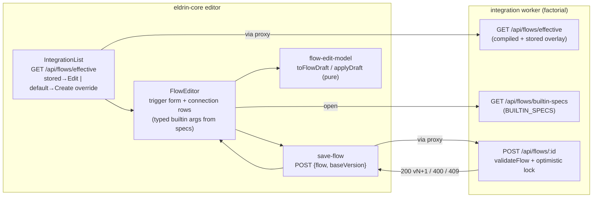

# Flow Editor (form-based) — Design Spec

**Date:** 2026-06-28
**Status:** Approved for planning
**Sub-project:** 4c of 5 (CPI-style integration flow platform) — second slice of the authoring UI
**Scope:** TWO repos — five small prerequisite changes in `eldrin-integration` (SDK) + `eldrin-factorial` (manifest), then the editor in `eldrin-core` (shell).
**Builds on:** SP1–SP3 (flow model → mapping engine → flow persistence) and SP4a (read-only Integrations studio) — all merged to their `main`s.

---

## Context & Motivation

SP4a made the Integrations studio *read* flows. This slice makes it *write* them: an admin
opens a flow (a stored override, or a compiled default via "Create override"), edits its
**map connections** (target column ← source field(s), through a transformer:
pass-through / builtin / snippet) and its **trigger** (cron / manual / webhook), and saves via
`POST /api/flows/:id` with the SP3 optimistic-lock `baseVersion`. The editor is the read-only
connection table made editable; source / native-transform / destination nodes stay read-only
(they are descriptor-derived structure).

Two seam bugs found during SP4a live-testing are **prerequisites** — the editor's save path
cannot work without them — plus three supporting SDK additions the editor needs:

1. **Hook-name mismatch (round-trip bug).** The compiler labels native transform nodes by
   descriptor *slot* (`hook:'transform'` / `'beforeUpsert'`), but `validateFlow` checks the
   name against the raw hook *registry* (keyed by function name, e.g. `deriveFullName`). So a
   compiler-produced flow fails to save. **Fix:** validation accepts a native hook name that
   matches *either* a registry function-name OR a known descriptor slot.
2. **Manifest routes undeclared (proxy 401).** Factorial's manifest declares no `/api/flows`
   routes, so the shell proxy's permission gate 401s POST through it. **Fix:** declare the
   `/api/flows` routes (`flows:read` reads, `flows:admin` writes).
3. **No compiled-defaults endpoint.** `GET /api/flows` is store-only, so a fresh integration
   (zero stored flows) has nothing to edit. **Fix:** `GET /api/flows/effective` returns the
   effective set (compiled defaults overlaid by stored), powering "edit existing" + "create
   override."
4. **Typed builtin args need a schema.** The editor renders labeled inputs per builtin, so it
   needs each builtin's arg shape. **Fix:** `BUILTIN_SPECS` in the SDK + a
   `GET /api/flows/builtin-specs` endpoint the UI fetches.

---

## Locked Decisions (from brainstorming)

1. **Editable scope:** the map node's **connections** + the **trigger**. Source, native
   transform, and destination nodes are read-only (descriptor-derived).
2. **Connection editor:** inline editable rows (add/remove/edit) — target, sources
   (multi-value), transformer (pass-through / builtin+args / snippet code).
3. **Save & conflict UX:** POST `{flow, baseVersion}`; 200 → "Saved (v{N+1})" + bump
   baseVersion; 400 → inline validation message (keep edits); 409 → "Changed elsewhere —
   Reload". No auto-merge; the optimistic lock is respected.
4. **Create vs edit:** edit stored flows AND "Create override" from a compiled default (seed
   editor with the compiled flow, save with `baseVersion:null` → version 1).
5. **Compiled-defaults source:** new `GET /api/flows/effective` (reuses `loadEffectiveFlows`'s
   overlay), each entry tagged `stored:boolean` + `version:number|null`.
6. **Hook-slot set:** validation accepts the fixed native slots `['transform','beforeUpsert']`
   (the only slots the compiler emits) OR registry function-names. Fixed-and-minimal, not
   derived — a broader accepted set weakens validation.
7. **Typed args:** per-builtin labeled inputs driven by `BUILTIN_SPECS` (SDK-canonical),
   fetched by the UI via `GET /api/flows/builtin-specs` once at editor-open (cached), not a
   local mirror.
8. **`applyDraft` preserves non-map structure verbatim** — deep-copies the original flow and
   swaps only `map.config.connections` + `flow.trigger`. The editor structurally cannot touch
   source/transform/destination/edges.

---

## Architecture



An admin lists effective flows, opens one in the editor (seeded from its flow + fetched
builtin specs), edits connections + trigger, and saves through the proxy. `applyDraft` rebuilds
the flow preserving all non-map structure; the SDK validates (now accepting compiler hook
slots) and applies the optimistic lock. Pure-logic units carry the risk; components stay thin.

**Two repos, sequenced:** the SDK + manifest changes ship first (the editor depends on all of
them); then the eldrin-core editor. Built on the merged SP4a.

---

## SDK & Manifest Prerequisite Changes

### (a) `validateFlow` accepts both hook-name forms

`src/flow/validate.ts`: `FlowValidationContext` gains an optional `hookSlots: Set<string>`. The
native transform/filter reference check passes if the name is in `hooks` (registry function
name) OR in `hookSlots` (descriptor slot).

```ts
export interface FlowValidationContext {
  hooks: HookRegistry;
  hookSlots?: Set<string>;       // descriptor slots, e.g. 'transform', 'beforeUpsert'
  knownTables: Set<string>;
}
// native-hook check:
const known = !!ctx.hooks[name] || (ctx.hookSlots?.has(name) ?? false);
if (!known) fail(`${node.kind} node ${node.id}: hook '${name}' not found`);
```

The route (`create-worker.ts`) passes
`hookSlots: new Set(['transform', 'beforeUpsert'])` — the fixed slots the compiler emits.
Execution is unchanged; only validation broadens to accept what the compiler produces.

### (b) `GET /api/flows/effective`

New admin-gated route in `create-worker.ts` (`resolveUserId`→401, `isAdmin`→403), registered
**before** `/api/flows/:id` (Hono ordering — else `:id` captures `effective`):

```ts
app.get('/api/flows/effective', async (c) => {
  const userId = resolveUserId(c);
  if (!userId) return c.json({ error: 'Unauthorized' }, 401);
  if (!isAdmin(c)) return c.json({ error: 'Forbidden: admin role required' }, 403);
  const { db, effective } = await prepare(c.env);
  const compiled = compileDescriptorToFlows(effective);
  const stored = new Map((await listFlows(db)).map((s) => [s.id, s]));
  const out = compiled.map((flow) => {
    const s = stored.get(flow.id);
    return { flow: s ? s.flow : flow, version: s ? s.version : null, stored: !!s };
  });
  return c.json(out);
});
```

Returns every compiled flow overlaid by its stored version if present, tagged
`stored: boolean` + `version: number|null`. Gives the overlay logic a real runtime consumer
(closes the SP3 final-review follow-up about `loadEffectiveFlows` being dead code — this route
performs the equivalent overlay).

### (c) `BUILTIN_SPECS` + `GET /api/flows/builtin-specs`

`src/flow/transformers/specs.ts` (new): a declarative arg-schema, one entry per `BUILTINS` key.

```ts
export interface BuiltinArg { name: string; type: 'string' | 'number'; optional?: boolean; }
export const BUILTIN_SPECS: Record<string, BuiltinArg[]> = {
  concat:     [{ name: 'separator', type: 'string' }],
  substring:  [{ name: 'start', type: 'number' }, { name: 'end', type: 'number', optional: true }],
  upperCase:  [],
  lowerCase:  [],
  trim:       [],
  replace:    [{ name: 'search', type: 'string' }, { name: 'replacement', type: 'string' }],
  ifThenElse: [{ name: 'then', type: 'string' }, { name: 'else', type: 'string' }],
  equals:     [],
  formatDate: [{ name: 'pattern', type: 'string' }],
  coalesce:   [],
  constant:   [{ name: 'value', type: 'string' }],
};
```

A new admin-gated `GET /api/flows/builtin-specs` returns `BUILTIN_SPECS`. The UI fetches it once
at editor-open and caches it. (A test asserts `BUILTIN_SPECS` keys exactly match `BUILTINS`
keys — kept in lockstep.)

### (d) Factorial manifest declares `/api/flows` routes

`eldrin-factorial/public/eldrin-app.manifest.json` `api.routes` += (mirroring `schema:prune`):

```jsonc
{ "method": "GET",    "path": "/api/flows",           "permission": "flows:read" },
{ "method": "GET",    "path": "/api/flows/effective", "permission": "flows:read" },
{ "method": "GET",    "path": "/api/flows/builtin-specs", "permission": "flows:read" },
{ "method": "GET",    "path": "/api/flows/:id",       "permission": "flows:read" },
{ "method": "POST",   "path": "/api/flows/:id",       "permission": "flows:admin" },
{ "method": "DELETE", "path": "/api/flows/:id",       "permission": "flows:admin" }
```

The `admin` role (`*:*`) passes the proxy gate; the SDK's `isAdmin` remains the real
enforcement (defense in depth).

---

## Flow ↔ Form Model (eldrin-core, pure logic)

`src/pages/integrations/flow-edit-model.ts` — the editor's risk surface, unit-tested.

```ts
export interface ConnectionDraft {
  target: string;
  sources: string[];
  transformKind: 'passthrough' | 'builtin' | 'snippet';
  builtinFn?: string;            // when transformKind === 'builtin'
  builtinArgs?: Record<string, string>;  // raw input values keyed by spec arg name
  snippet?: string;              // when transformKind === 'snippet'
}
export interface FlowDraft {
  trigger: { kind: 'cron'; expr: string } | { kind: 'webhook'; event: string } | { kind: 'manual' };
  connections: ConnectionDraft[];
}

export function toFlowDraft(flow: FlowGraph): FlowDraft;
// Extract trigger + the map node's connections; un-discriminate each TransformerRef into
// transformKind + fields. For a builtin, map its positional args[] back to a name-keyed
// record using BUILTIN_SPECS (passed in or fetched) so the form can bind labeled inputs.

export function applyDraft(
  original: FlowGraph,
  draft: FlowDraft,
  specs: Record<string, BuiltinArg[]>,
): { ok: true; flow: FlowGraph } | { ok: false; error: string };
// Deep-copy original; replace ONLY map.config.connections + flow.trigger. Re-assemble each
// ConnectionDraft into a TransformerRef: passthrough → no transform; snippet → {kind:'snippet',
// code}; builtin → {kind:'builtin', fn, args} where args is built from builtinArgs coerced per
// the spec's type (string as-is; number via Number(), erroring on NaN for a required arg;
// optional+empty omitted from the tail). Malformed/missing required arg → {ok:false, error}.
```

**Guarantees:** `applyDraft` never regenerates source/transform/destination/edges — it copies
them verbatim, so an edit cannot structurally damage the parts the editor doesn't expose.
Round-trip `applyDraft(orig, toFlowDraft(orig), specs)` ≡ `orig` for an unchanged flow.

`src/pages/integrations/save-flow.ts`:

```ts
export function saveFlow(
  appId: string, flow: FlowGraph, baseVersion: number | null, authFetch: AuthFetch,
): Promise<Result<{ version: number }>>;
// POST /api/flows/:id with { flow, baseVersion } via the proxy; map 200→{version}, 400/409→
// {ok:false,status,error}, throw→{ok:false,error}. Reuses SP4a's Result + AuthFetch.
```

New API fns in `integrations-api.ts`: `fetchEffectiveFlows(appId, authFetch)` (parses the
tagged list), `fetchBuiltinSpecs(appId, authFetch)` (parses the spec map).

**Cross-repo type note:** the shell does not import the SDK, so it defines its own local
`BuiltinArg` type (`{ name: string; type: 'string' | 'number'; optional?: boolean }`) mirroring
the SDK's — consistent with how SP4a mirrors the `Flow`/`FlowGraph` types locally. The actual
spec *values* come from the `/api/flows/builtin-specs` endpoint at runtime (not a value mirror);
only the small type shape is mirrored.

---

## Editor Components (eldrin-core)

- **`IntegrationList.tsx`** (revised) — reads `GET /api/flows/effective`. Each entry by
  `stored`: `true` → id + `v{version}` + **Edit** (+ the existing read-only View); `false` →
  id + "default" + **Create override**. Both open `FlowEditor` seeded with the entry's `flow`
  and `baseVersion` (the version, or `null` for create).
- **`FlowEditor.tsx`** (thin, over the pure model):
  - On open: `toFlowDraft(flow)` → form state; `fetchBuiltinSpecs` once (cached).
  - **Trigger form:** kind selector (cron/manual/webhook) + conditional field (cron expr /
    webhook event).
  - **Connection rows** (`ConnectionRowEditor`): target input; sources multi-field (chips,
    add/remove); transformer selector (pass-through | builtin | snippet). Builtin → typed arg
    inputs rendered from the fetched spec for that fn; snippet → code textarea. Add/remove row.
  - **Save:** `applyDraft(original, draft, specs)` → on `ok:false` show the arg error inline;
    on `ok` → `saveFlow(appId, flow, baseVersion, authFetch)` → 200 "Saved (v{N+1})" + bump
    baseVersion; 400 → inline validation message (keep edits); 409 → "Changed elsewhere —
    Reload".
- Reuses SP4a's `authFetch` injection seam, `Result<T>`, the proxy path, the FlowDetail
  read-only viewer (unchanged, still available as "View").

---

## Testing

**SDK (eldrin-integration) — Vitest:**
- `validate.test.ts` (extend) — accepts a native hook by slot (`'transform'` via `hookSlots`)
  AND by registry name (`deriveFullName` via `hooks`); rejects a name in neither.
- `create-worker.test.ts` (extend) — `GET /api/flows/effective`: admin → 200 tagged set
  (compiled-only → `stored:false,version:null`; with an override → `stored:true,version:N`);
  non-admin → 403; `effective` is not captured as `:id` (route order). `GET
  /api/flows/builtin-specs`: returns the spec map; admin-gated.
- `transformers/specs.test.ts` (new) — `BUILTIN_SPECS` keys exactly equal `BUILTINS` keys.

**Shell (eldrin-core) — Vitest pure-logic units:**
- `flow-edit-model.test.ts` — `toFlowDraft` (trigger + connections, un-discriminated
  transformer); `applyDraft` (preserves source/transform/destination/edges byte-for-byte;
  replaces only connections + trigger; re-assembles TransformerRefs; builtin args coerced per
  spec type; required-arg-missing/NaN → error; idempotent round-trip on an unchanged flow).
- `save-flow.test.ts` — `saveFlow` mock authFetch: 200→{version}; 400/409→{ok:false,status};
  throw→{ok:false,error}.
- `integrations-api.test.ts` (extend) — `fetchEffectiveFlows` parses the tagged list;
  `fetchBuiltinSpecs` parses the spec map.

**Shell components** — thin, not unit-tested (no `@testing-library`, per SP4a's standing
decision).

**One Playwright smoke** (`e2e/flow-editor.spec.ts`) — admin → Integrations → Edit/Create
override → change a connection's transformer (e.g. pass-through → concat with a separator) →
Save → assert "Saved" + version bump. Runs live (browsers permitting; else documented skip
like SP4a).

**Coverage:** pure-logic units ≥ 80%; `applyDraft` is the heart and gets the most cases.

---

## Out of Scope (this slice)

- Editing source / native-transform / destination nodes (descriptor-derived; read-only).
- Adding/removing nodes or rewiring edges; multi-node graph editing (SP5 canvas).
- Deleting a stored flow from the UI (the DELETE route is declared in the manifest for
  completeness, but a delete button is deferred — easy follow-up).
- Per-builtin advanced arg widgets beyond `string`/`number` typed inputs (e.g. date pickers).
- A visual drag-and-drop mapping canvas (SP5).
- Building a flow from scratch / arbitrary source+destination beyond descriptor resources (SP5).

## Sequencing

1. **SDK (eldrin-integration):** validate-both-hooks → `BUILTIN_SPECS` + specs route →
   `/api/flows/effective` route. **Manifest (eldrin-factorial):** declare `/api/flows` routes.
   Merge to SDK `main`.
2. **eldrin-core:** API fns (`fetchEffectiveFlows`, `fetchBuiltinSpecs`) → pure model
   (`flow-edit-model`, `save-flow`) → revised `IntegrationList` → `FlowEditor` +
   `ConnectionRowEditor` → trigger form → Playwright smoke.
