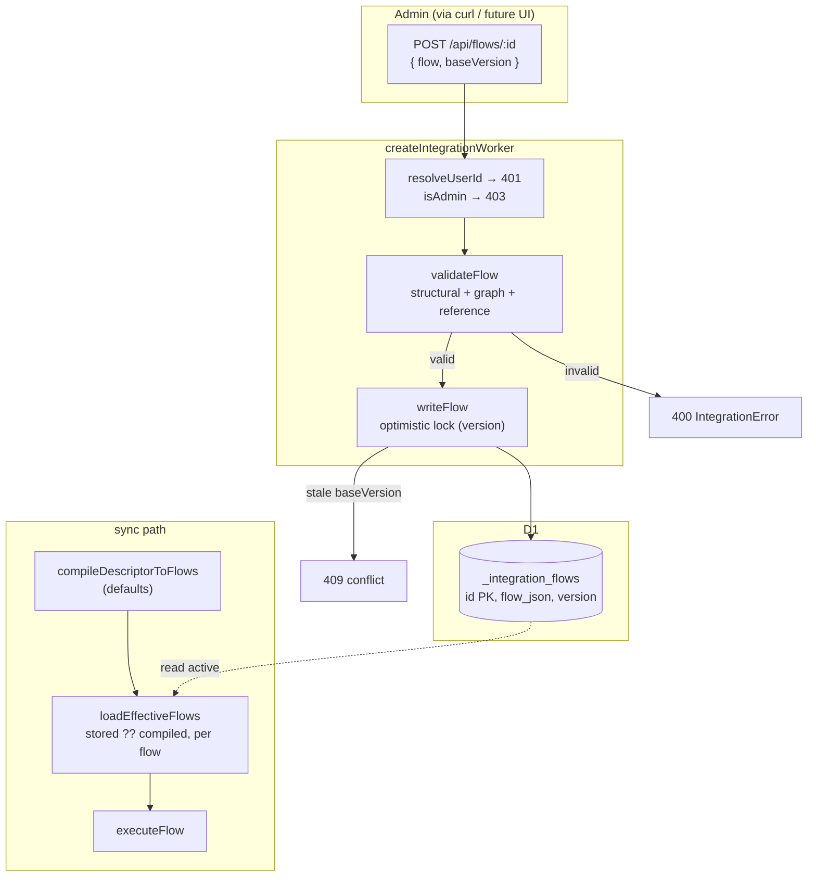
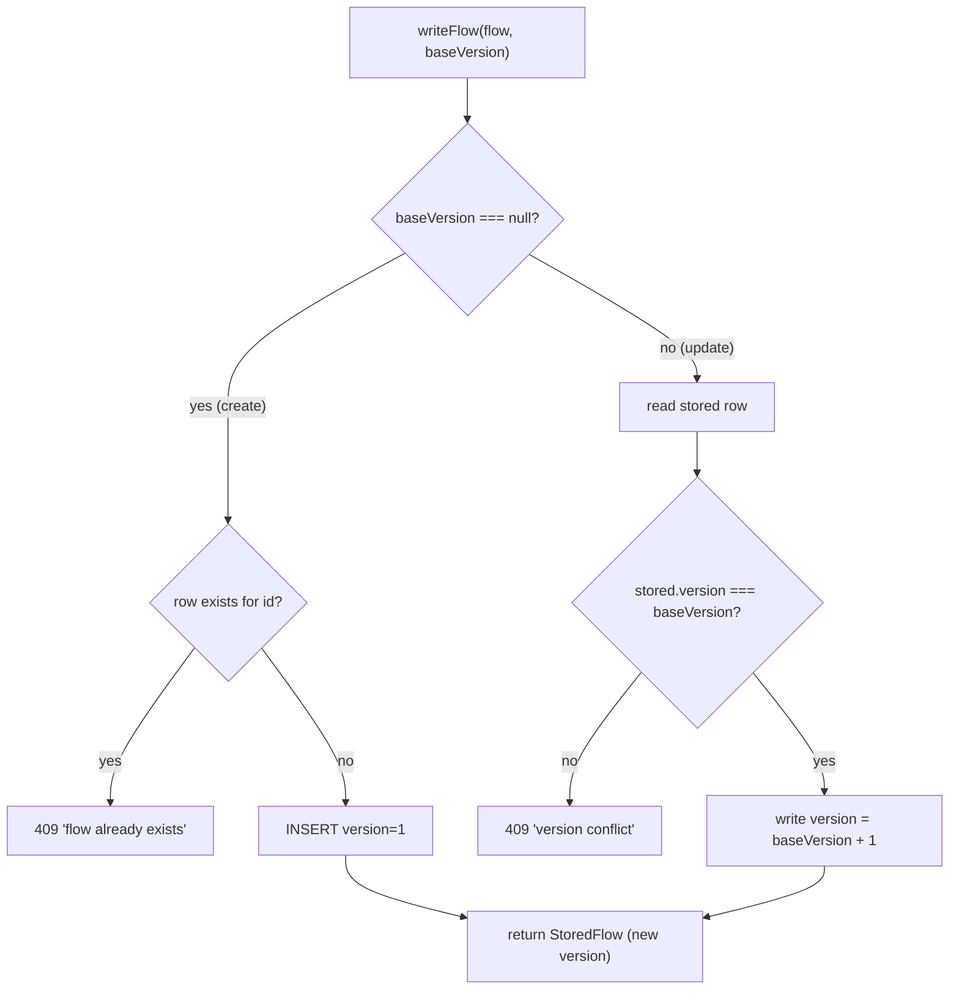
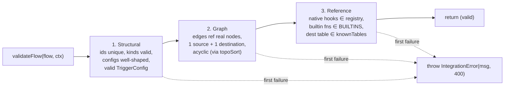
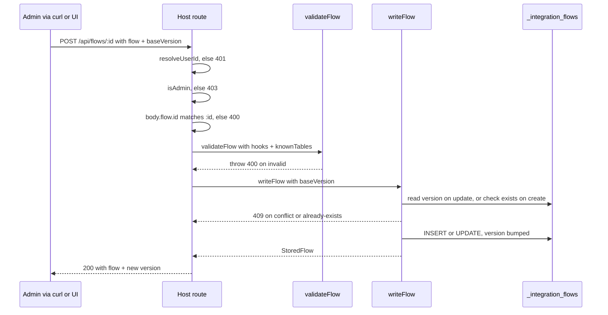
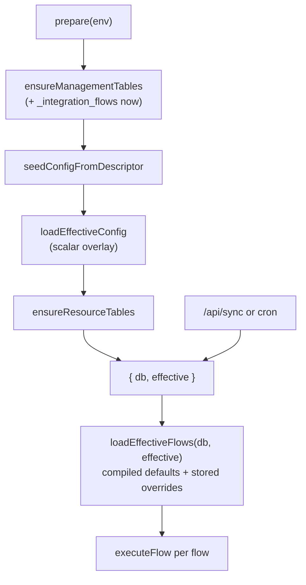

# Flow Persistence & CRUD API — Design Spec

**Date:** 2026-06-28
**Status:** Approved for planning
**Sub-project:** 3 of 5 (CPI-style integration flow platform)
**Scope:** SDK only (`@eldrin-project/eldrin-integration`). No UI.
**Builds on:** Sub-projects 1 (flow graph model & executor), 1.5 (streaming executor), 2 (mapping engine) — all merged to SDK `main`.

---

## Context & Motivation

Flows are currently compiled fresh from the `IntegrationDescriptor` on every sync, in
memory, ephemeral (`compileDescriptorToFlows`). There is no way to persist or edit a flow —
which blocks the eventual authoring UI (sub-project 4), whose entire purpose is to change
what executes.

This sub-project makes flows **editable, versioned data**. It adds a persistence layer
(stored flow graphs as JSON), a validation layer (gate malformed flows before they execute),
and an admin-gated REST surface — mirroring the existing config-overlay pattern
(`loadEffectiveConfig`) one layer up: instead of overlaying scalar config onto the
descriptor, we overlay whole flow graphs.

The guarantee: an integration with **no stored flows behaves identically to today**
(Factorial unchanged); editing a flow persists a new version that overrides the compiled
default on the next run.

### Versioning decision (trimmed from full history — recorded)

Brainstorming initially chose full append-only version history + an explicit active pointer.
On YAGNI review this was **trimmed to optimistic-lock versioning** (single row per flow, an
integer `version` counter, 409 on stale write). Rationale: the *value* of history (rollback,
diff-over-time) is only realized through a UI that does not exist until sub-project 4, and
the history model is the part most likely to be reshaped once the UI is real (named versions?
draft/published? per-field audit?). The `version` column makes a later upgrade to full
history additive. **History / rollback / version-history endpoints are deferred to a
UI-attached slice.**

### Roadmap

| # | Sub-project | Status |
|---|---|---|
| 1 | Flow graph model + executor | DONE (merged) |
| 1.5 | Streaming executor + batched sink | DONE (merged) |
| 2 | Field-mapping engine + transformers | DONE (merged) |
| **3** | **Flow persistence + CRUD API (this spec)** | this spec |
| 4 | Flow authoring UI (Integrations side-nav) | future — owns history/rollback UX |
| 5 | Visual graph canvas + arbitrary destinations | future |

---

## Locked Decisions (from brainstorming)

1. **Stored overrides compiled, per flow.** At load, compile the descriptor to flows as the
   default (unchanged); for each flow, a stored active version — if present — replaces the
   compiled one. Same overlay shape as `loadEffectiveConfig`.
2. **Optimistic-lock versioning, latest-only.** One row per flow; integer `version`
   increments on each write; a write declaring a stale `baseVersion` → 409. No history table
   this slice.
3. **Full validation before persist** — structural + graph + reference, fail-fast 400.
   Snippet code is stored, not executed, at validate time.
4. **REST under `/api/flows`, all admin-gated** (`resolveUserId` → 401, `isAdmin` → 403),
   mounted via the host's existing `options.extend`-before-wildcards seam.
5. **`flow.id` (`"<integration>:<resource>"`) is the persistence key**; the overlay
   substitutes only flows whose id matches a compiled flow.

---

## Architecture



A new `_integration_flows` table stores flow graphs as JSON. A validation layer gates every
write. At sync time, `loadEffectiveFlows` produces the executable set: compiled defaults with
stored overrides applied per flow. Pure SDK, no UI (sub-project 4).

---

## Data Model & Persistence

### Table

Added to `SDK_TABLES` in `src/schema/tables.ts` so `ensureManagementTables` creates it
alongside the existing `_integration_*` tables — no migration file (config-derived schema,
consistent with the rest of the SDK).

```sql
CREATE TABLE IF NOT EXISTS _integration_flows (
  id TEXT PRIMARY KEY,            -- flow.id, e.g. "factorial:employees"
  integration_id TEXT NOT NULL,
  flow_json TEXT NOT NULL,        -- the serialized Flow graph
  version INTEGER NOT NULL,       -- increments on every write; optimistic lock
  created_at INTEGER NOT NULL,
  updated_at INTEGER NOT NULL
)
```

Exported as `FLOWS_DDL` and appended to `SDK_TABLES`.

### Functions (new `src/flow/store.ts`)

```ts
export interface StoredFlow {
  id: string;
  integrationId: string;
  flow: Flow;            // parsed from flow_json
  version: number;
  createdAt: number;
  updatedAt: number;
}

export async function readFlow(db: DatabaseAdapter, id: string): Promise<StoredFlow | null>;
export async function listFlows(db: DatabaseAdapter): Promise<StoredFlow[]>;
export async function writeFlow(
  db: DatabaseAdapter,
  flow: Flow,
  baseVersion: number | null,   // null = create; N = update from version N
  now: () => number,
): Promise<StoredFlow>;
export async function deleteFlow(db: DatabaseAdapter, id: string): Promise<boolean>; // true if removed
export async function loadEffectiveFlows(
  db: DatabaseAdapter,
  descriptor: IntegrationDescriptor,
): Promise<Flow[]>;
```

### `writeFlow` — the optimistic-lock core



### The execution overlay — `loadEffectiveFlows`

```ts
export async function loadEffectiveFlows(db, descriptor): Promise<Flow[]> {
  const compiled = compileDescriptorToFlows(descriptor);   // today's defaults
  const out: Flow[] = [];
  for (const def of compiled) {
    const stored = await readFlow(db, def.id);
    out.push(stored ? stored.flow : def);                  // stored overrides compiled, per flow
  }
  return out;
}
```

### Decisions

1. **`flow.id` is the primary key** (`"<integration>:<resource>"`). A stored flow overrides
   the compiled flow with the same id. A stored flow whose id matches no compiled flow is
   returned by `listFlows`/CRUD but does not execute (no descriptor resource drives it);
   the UI may later surface it as orphaned.
2. **The overlay iterates the compiled set, not the stored set** — so a stored flow for a
   since-removed resource silently does not execute, matching how `loadEffectiveConfig` only
   overlays resources still in the descriptor. Executing flows *beyond* the descriptor is a
   bigger model shift (sub-project 5), out of scope here.
3. **`flow_json` is a TEXT blob** (whole-graph replace per write), not normalized into
   node/edge tables. The Flow is validated before storage, so row-level relational integrity
   is unnecessary; querying inside flows is not a near-term need.

---

## Flow Validation

New `src/flow/validate.ts` — fail-fast like `validateDescriptor`, throws
`IntegrationError(msg, 400)` on the first failure. Called by the CRUD upsert handler before
`writeFlow`.

```ts
export interface FlowValidationContext {
  hooks: HookRegistry;          // native transform/filter hook names must exist here
  knownTables: Set<string>;     // destination table must be one of these
}

export function validateFlow(flow: Flow, ctx: FlowValidationContext): void;
```



**Layer detail:**

1. **Structural** — `flow.id`/`integrationId` non-empty; `nodes` non-empty; every node `id`
   unique; every `kind` ∈ `NodeKind`; each node's `config` matches its kind (a `map` has
   `connections: Connection[]`, each connection a `target` + non-empty `sources`, each
   `TransformerRef` a well-formed `builtin`/`snippet` union; a `destination` has `kind:'d1'`
   + `table`). `trigger` is a valid `TriggerConfig`.
2. **Graph** — every edge `from`/`to` references an existing node id; exactly one `source`
   and one `destination` node; the graph is acyclic. Reuses the executor's `topoSort` (lifted
   to a shared `src/flow/graph.ts`), which already throws `IntegrationError` on cycle and
   unknown-node — keeping validation and execution agreeing on "a valid graph."
3. **Reference** — each `transform`/`filter` node with `mode:'native'` has its `hook` in
   `ctx.hooks`; each map connection with `transform.kind:'builtin'` has its `fn` in
   `BUILTINS`; each `destination.table` ∈ `ctx.knownTables`. Snippet `code` is stored, not
   executed, at validate time (the sandbox guards it at execution).

### Decisions

1. **Lift `topoSort` to `src/flow/graph.ts`** (shared by `execute.ts` and `validate.ts`)
   rather than exporting it from `execute.ts` in place — it is shared graph infrastructure;
   the move is behavior-preserving and keeps `execute.ts` focused.
2. **`knownTables` is built from descriptor resource names** by the caller
   (`new Set(effective.resources.map(r => r.name))`). A flow can only target a table the
   descriptor declares — a guardrail against typos and writes to unmanaged tables. Arbitrary
   destinations are sub-project 5.

---

## REST API & Host Wiring

Four routes under `/api/flows`, **all admin-gated** (`resolveUserId` → 401, `isAdmin` → 403),
mounted via `options.extend` before the wildcard routes in `create-worker.ts`, reusing the
established response envelope (`c.json(data)` / `c.json({ error }, status)`).

| Method | Route | Behavior |
|---|---|---|
| GET | `/api/flows` | list stored flows + metadata (id, integrationId, version, updatedAt) |
| GET | `/api/flows/:id` | the stored flow (404 if none stored — reads the store, not the compiled set) |
| POST | `/api/flows/:id` | validate → `writeFlow(baseVersion)` → 200 `{flow,version}` \| 400 \| 409 |
| DELETE | `/api/flows/:id` | `deleteFlow` → 200 `{deleted:true}` \| 404 |

The upsert body is `{ flow: Flow, baseVersion: number | null }` — `null` to create, the
current version to update; mismatch → 409.



### Upsert handler (representative)

```ts
app.post('/api/flows/:id', async (c) => {
  const userId = resolveUserId(c);
  if (!userId) return c.json({ error: 'Unauthorized' }, 401);
  if (!isAdmin(c)) return c.json({ error: 'Forbidden: admin role required' }, 403);
  const { db, effective } = await prepare(c.env);
  const body = await c.req.json().catch(() => null);
  if (!body?.flow) return c.json({ error: 'Missing flow in body' }, 400);
  if (body.flow.id !== c.req.param('id')) return c.json({ error: 'Flow id mismatch' }, 400);
  try {
    validateFlow(body.flow, {
      hooks: boundHooks,
      knownTables: new Set(effective.resources.map((r) => r.name)),
    });
    const stored = await writeFlow(db, body.flow, body.baseVersion ?? null, () => Date.now());
    return c.json({ flow: stored.flow, version: stored.version });
  } catch (e) {
    const status = e instanceof IntegrationError ? e.status : 500;
    return c.json({ error: e instanceof Error ? e.message : 'Write failed' }, status as 400 | 409 | 500);
  }
});
```

(`boundHooks` is the worker's already-bound hook registry; `effective.resources` supplies
`knownTables`.)

### Lifecycle wiring



- `ensureManagementTables` now also creates `_integration_flows` (via the `SDK_TABLES`
  addition).
- The sync execution path changes from `compileDescriptorToFlows(effective)` to
  **`loadEffectiveFlows(db, effective)`** — the single behavioral hook that makes stored
  flows execute. For a resource with a stored flow, the stored flow runs; else the compiled
  default. This threads through `runResourceSync`/`runAllSync`.

### Decisions

1. **`GET /api/flows/:id` reads the store only** (404 when nothing is stored) — it returns
   "what is persisted," not "what would execute." A "compiled default / effective flow"
   read endpoint can be composed later if the UI needs it; keeping this endpoint = the store
   is the simpler contract.
2. **`loadEffectiveFlows` is the one runtime behavior change** and the locus of regression
   risk. With no stored flows it returns the compiled set unchanged, so Factorial is
   byte-identical. The existing regression gate must stay green *through* this path, not
   around it (see Testing).

---

## Testing

Vitest, in-memory `makeTestDb`. Coverage ≥ 80%.

- **`src/flow/store.test.ts`** — persistence + optimistic lock:
  - create (baseVersion null) → version 1; second create same id → 409 `already exists`
  - update with correct baseVersion → version increments; stale baseVersion → 409 `version conflict`
  - `readFlow` returns parsed `Flow` / null when absent
  - `listFlows` returns all with metadata
  - `deleteFlow` → true when removed, false when absent; then `readFlow` → null
  - round-trip: a Flow written then read is deep-equal (serialization fidelity)
- **`src/flow/validate.test.ts`** — three layers:
  - structural: duplicate node id; unknown kind; malformed map connection (empty sources);
    bad TransformerRef → each 400
  - graph: edge → missing node; zero/two source nodes; two destinations; a cycle → each 400
  - reference: native hook not in registry; builtin fn not in BUILTINS; dest table not in
    knownTables → each 400
  - happy path: a valid Factorial-shaped flow passes
  - a flow with a `snippet` connection passes validation without executing the code
- **`src/flow/graph.test.ts`** — `topoSort` lift is behavior-preserving; the execute tests
  that exercise cycle/unknown-node detection stay green.
- **`src/host/create-worker.test.ts`** (extend) — the 4 routes:
  - each: no auth → 401; authed non-admin → 403; admin → success (mirrors prune-route tests)
  - upsert: valid → 200 + version; invalid → 400; id mismatch (body vs path) → 400; stale
    baseVersion → 409
  - delete: existing → 200 `{deleted:true}`; absent → 404
  - list/read: admin returns stored flows / 404 for unstored id
- **`loadEffectiveFlows` overlay test** — no stored flow → compiled default unchanged; a
  stored flow for id X → replaces compiled X, others untouched.
- **Regression gate** — the existing Factorial byte-identical test stays green **through the
  new `loadEffectiveFlows` path** (no stored flows → pass-through). The safety net for the
  one runtime change.
- `tsc --noEmit` + `npm run build` clean (no better-sqlite3 in bundle); **Factorial
  `host-sync.test.ts` green** (cross-repo proof the overlay doesn't disturb the live sync).

---

## Public API Additions (`src/index.ts`)

```ts
export { readFlow, listFlows, writeFlow, deleteFlow, loadEffectiveFlows, type StoredFlow } from './flow/store';
export { validateFlow, type FlowValidationContext } from './flow/validate';
export { FLOWS_DDL } from './schema/tables';                 // added to SDK_TABLES
export { topoSort } from './flow/graph';                     // lifted from execute.ts (if surfaced)
```

## Out of Scope (this slice)

- Version history, rollback, version-history endpoints — deferred to a UI-attached slice.
- Executing flows beyond the descriptor's resources (arbitrary destinations) — sub-project 5.
- The authoring UI — sub-project 4.
- A "compiled default / effective flow" read endpoint — compose later if the UI needs it.
- Editing niceties (partial patches, field-level diffs) — a write replaces the whole flow
  graph as one new version.
