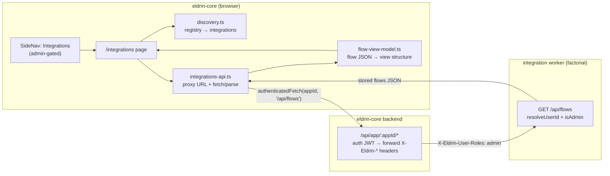

# Read-Only Integrations Studio — Design Spec

**Date:** 2026-06-28
**Status:** Approved for planning
**Sub-project:** 4a of 5 (CPI-style integration flow platform) — first slice of sub-project 4 (authoring UI)
**Scope:** TWO repos — a small prerequisite fix in `eldrin-integration` (SDK), then the UI in `eldrin-core` (shell). No editing, no canvas.
**Builds on:** SP1 (flow model), SP1.5 (streaming), SP2 (mapping engine), SP3 (flow persistence + `/api/flows` CRUD) — all merged to SDK `main`.

---

## Context & Motivation

Sub-projects 1–3 built the backend: a flow model, a streaming executor, a field-mapping
engine, and a persisted, admin-gated `/api/flows` CRUD API on the integration worker. Nothing
yet *consumes* that API with a human interface. Sub-project 4 is the authoring UI — the
"Integrations" studio in the eldrin-core shell. It is large (a full flow editor evolving
toward a CPI-style canvas), so it is sliced:

- **4a (this spec):** a READ-ONLY studio — list integrations, list their flows, view a flow's
  graph. Proves the entire cross-repo plumbing (admin nav, route, proxy API call, integration
  discovery, rendering real flows) at minimal risk, and is genuinely useful (inspect what runs).
- **4c (later):** form-based flow editing (create/update/delete, connection editor, snippet
  editing) — the full CRUD loop in the UI.
- **5:** the visual drag-and-drop mapping canvas.

### A prerequisite cross-repo auth fix (discovered during design)

The shell reaches an integration worker's API through a backend proxy:
`/api/app/:appId/*` (`eldrin-core/core/routes/apps.ts` `handleAppApiProxy`). The proxy
authenticates the caller's JWT, then forwards identity to the integration as **`X-Eldrin-*`
headers** (`X-Eldrin-User-Id`, `X-Eldrin-User-Roles`, …) — it does NOT pass the original Bearer
JWT through. But the integration SDK's `isAdmin(c)` reads `platformRoles` **only from a Bearer
JWT**. So every admin-gated call (`/api/flows`, `/api/schema/prune`) made through the proxy —
the only path the UI can use — would return **403 even for admins**. This must be fixed before
the UI can function. The fix lives in the SDK (ships first); see "SDK Fix" below.

---

## Locked Decisions (from brainstorming)

1. **Slice 4a is read-only:** nav section + flow list + read-only flow viewer. No editing.
2. **SDK fix first:** `isAdmin(c)` honors the proxy-forwarded `X-Eldrin-User-Roles` header in
   addition to the Bearer JWT — mirroring how `resolveUserId` already accepts
   `X-Eldrin-User-Id` OR the JWT `sub`. Trust model: the proxy is the authenticated boundary.
3. **Integration discovery:** read the shell's existing app registry (`useAppRegistry`), filter
   `manifest.kind === 'integration'`. No new backend endpoint.
4. **Flow viewer:** linear node list (source → … → destination in pipeline order) with the map
   node's connections in an expandable table (target ← sources, transformer label, snippet code
   if present). No graph-layout library.
5. **Testing:** pure-logic units in Vitest (discovery filter, API layer, flow view-model) with
   thin presentational components; one Playwright E2E smoke. No new component-test stack
   (`@testing-library/react` not added).
6. **Nav placement:** a new admin-gated "Integrations" top-level side-nav section (decided in
   the platform design), not a Settings tab.

---

## Architecture



An admin-gated "Integrations" side-nav item opens `/integrations`. The page discovers
integrations from the app registry, fetches each one's stored flows from `/api/flows` through
the shell proxy, and renders a flow's graph read-only. All risk-bearing logic
(discovery, API, view-model) is pure functions; the React components are thin wrappers. The
SDK `isAdmin` fix makes the proxy path actually return flows to an admin.

**Two repos, sequenced:** the SDK `isAdmin` fix merges to SDK `main` first (it is independently
valuable and testable); then the eldrin-core UI is built on top.

---

## SDK Fix — `isAdmin` honors `X-Eldrin-User-Roles`

`eldrin-integration/src/host/create-worker.ts`. Mirror `resolveUserId`'s dual-source pattern.

```ts
function isAdmin(c: { req: { header: (name: string) => string | undefined } }): boolean {
  // Proxy-forwarded roles: the shell's /api/app proxy authenticated the JWT, then forwards
  // identity as X-Eldrin-* headers — same trust model as resolveUserId's X-Eldrin-User-Id.
  const headerRoles = c.req.header('X-Eldrin-User-Roles');
  if (headerRoles && headerRoles.split(',').map((r) => r.trim()).includes('admin')) return true;
  // Direct Bearer JWT (curl / non-proxied callers).
  const auth = c.req.header('Authorization');
  if (auth?.startsWith('Bearer ')) {
    try {
      const payload = JSON.parse(atob(auth.slice(7).split('.')[1]));
      const roles = payload.platformRoles;
      if (Array.isArray(roles) && roles.includes('admin')) return true;
    } catch { /* invalid JWT — not admin */ }
  }
  return false;
}
```

Also add `X-Eldrin-User-Roles` to the host CORS `allowHeaders` (currently
`['Content-Type', 'Authorization', 'X-Eldrin-User-Id']`) for consistency.

**Trust model (confirmed):** `X-Eldrin-User-Roles: admin` from the proxy is sufficient to grant
admin on the integration worker — the proxy verifies the JWT before forwarding and is the
authenticated boundary, exactly as already true for `resolveUserId` + `X-Eldrin-User-Id`. The
direct-JWT path still works for curl/non-proxied callers.

**Tests** (extend `create-worker.test.ts`): admin via `X-Eldrin-User-Roles: admin` header (no
Bearer) → 200 on an admin route; `X-Eldrin-User-Roles: viewer,user` → 403; existing Bearer-JWT
admin path still 200 (regression); both absent → 403.

This applies to ALL admin-gated routes (both `/api/flows` and the existing `/api/schema/prune`)
since they share `isAdmin`.

---

## UI Structure (eldrin-core)

```
src/
  pages/
    Integrations.tsx                  — route target; admin guard; renders IntegrationList
    integrations/
      IntegrationList.tsx             — lists integrations + their flows (thin)
      FlowDetail.tsx                  — read-only flow viewer (thin)
      discovery.ts                    — PURE: registry → integration list (unit-tested)
      integrations-api.ts             — PURE: proxy URL + /api/flows fetch/parse (unit-tested)
      flow-view-model.ts              — PURE: flow JSON → view structure (unit-tested)
  components/SideNav.tsx              — add admin "Integrations" nav item
  App.tsx                            — add /integrations route (inside <Shell>)
  locales/en/integrations.json       — new i18n namespace
```

### Pure-logic units (the tested risk)

```ts
// discovery.ts
export interface IntegrationRef { id: string; label: string; }
export function listIntegrations(apps: Map<string, AppRegistration>): IntegrationRef[];
// filters manifest.kind === 'integration'; returns { id, label }[]

// integrations-api.ts
export type Result<T> = { ok: true; data: T } | { ok: false; status?: number; error: string };
export type AuthFetch = (appId: string, input: string, init?: RequestInit) => Promise<Response>;
// FlowSummary = what GET /api/flows (list) returns per the SP3 list route: id/integrationId/version/updatedAt.
export interface FlowSummary { id: string; integrationId: string; version: number; updatedAt: number; }
// StoredFlow = what GET /api/flows/:id returns (the full record incl. the parsed Flow graph).
export interface StoredFlow { id: string; integrationId: string; flow: Flow; version: number; createdAt: number; updatedAt: number; }
export function flowsUrl(appId: string): string; // -> "/api/app/${appId}/api/flows"
export async function fetchFlows(appId: string, authFetch: AuthFetch): Promise<Result<FlowSummary[]>>;
export async function fetchFlow(appId: string, flowId: string, authFetch: AuthFetch): Promise<Result<StoredFlow>>;

// flow-view-model.ts
export interface FlowViewModel {
  id: string; version: number | null; trigger: string;          // human trigger summary
  nodes: { id: string; kind: string; summary: string }[];        // pipeline order
  connections: { target: string; sources: string[]; transform: string; snippet?: string }[];
}
export function toFlowViewModel(flow: Flow): FlowViewModel;
```

`authFetch` is **injected** (dependency injection) so `integrations-api.ts` is unit-testable
with a mock — the component passes `window.__ELDRIN__.authenticatedFetch`.

### Thin components

- **`Integrations.tsx`**: admin guard (`hasPlatformRole('admin')` → else `<Navigate to="/" replace />`),
  page header, renders `IntegrationList`. (Optionally a Tabs scaffold with only a "Flows" tab,
  to leave room for webhooks/monitoring later — not required.)
- **`IntegrationList.tsx`**: `useEffect`/`useState` (the codebase pattern — no react-query);
  `listIntegrations(registry)`, then per integration `fetchFlows(id, authFetch)`; renders each
  integration as a Card with its flows (id, version, trigger summary) + a "view" affordance;
  handles loading / error / forbidden / empty states.
- **`FlowDetail.tsx`**: takes a `FlowViewModel`, renders the ordered node list with the map
  node's connections in an expandable table. Pure presentation.

### API mechanism (verified end-to-end)

The components call `window.__ELDRIN__.authenticatedFetch(appId, '/api/flows')`
(`eldrin-core/src/stores/appRegistry.ts`), which builds the `/api/app/{appId}/...` proxy URL
and attaches the Bearer token. The shell proxy (`core/routes/apps.ts handleAppApiProxy`)
authenticates it and forwards `X-Eldrin-User-Roles`, which the fixed `isAdmin` honors. Verified
to exist end-to-end: frontend `authenticatedFetch` → backend `/api/app/:appId/*` route →
`handleAppApiProxy` (looks up app_url, forwards with X-Eldrin-* headers) → integration
`/api/flows`.

### Nav placement

Add an admin section to `SideNav.tsx` between the main nav and the dynamic app nav, gated by
`hasPlatformRole('admin')` so non-admins never see the item. The `/integrations` route mounts
inside `<Shell>` in `App.tsx`, mirroring the `/settings` registration. The page guards itself
too (defense in depth: nav hidden AND page redirects AND server `isAdmin`).

---

## States, Errors, Empty Cases

| State | Trigger | UI |
|---|---|---|
| Loading | fetch in flight | spinner/skeleton (existing settings pattern) |
| No integrations | `listIntegrations` → `[]` | "No integrations installed" empty state |
| No stored flows | `/api/flows` → `[]` | "No stored flow overrides — this integration runs its default compiled flows" |
| Forbidden | API 403 | "You need admin access" (defense-in-depth; nav+page guards should prevent reaching this) |
| Error | network / 500 | error message + retry button (existing try-again pattern) |
| Populated | flows returned | integration cards with flow rows; click → FlowDetail |

**The "no stored flows" nuance is important and must be honest:** `/api/flows` is the SP3
store-only endpoint — it returns only *persisted* flows. A fresh integration that syncs fine via
compiled defaults shows an empty stored-flows list. The copy must say "runs default compiled
flows," not "no flows," to avoid implying the integration is broken.

---

## Testing

- **`discovery.test.ts`** (Vitest) — `listIntegrations`: filters `kind==='integration'`,
  excludes regular apps, empty registry → `[]`, returns `{id,label}`.
- **`integrations-api.test.ts`** (Vitest) — `flowsUrl` builds `/api/app/{id}/api/flows`;
  `fetchFlows` with a mock `authFetch`: 200 → parsed summaries; 403 → `{ok:false,status:403}`;
  network throw → `{ok:false,error}`; empty array → `{ok:true,data:[]}` (no-stored-flows case).
- **`flow-view-model.test.ts`** (Vitest — the heart) — `toFlowViewModel`: a Factorial-shaped
  flow → correct ordered nodes; map node → connection rows with right transformer labels
  (pass-through, `concat` + args, `ifThenElse`, `snippet` with code surfaced); a flow with a
  transform node → it appears in order; trigger summaries (cron / manual / webhook).
- **SDK** (`create-worker.test.ts`) — the `isAdmin` header tests above.
- **One Playwright E2E smoke** (`e2e/integrations.spec.ts`) — log in as admin → click the
  Integrations nav item → `/integrations` renders the integration list. Proves nav + route +
  guard + render wire together.
- Coverage: the three logic units ≥ 80%; components are thin, exercised by the smoke.
- The live proxy → flows path is validated manually post-merge (start shell + factorial,
  navigate, see real flows), consistent with prior passes.

---

## Out of Scope (this slice)

- All editing — create/update/delete flows, connection editor, snippet editing (sub-project 4c).
- The visual drag-and-drop mapping canvas (sub-project 5).
- A "view source / raw JSON" flow toggle (nice-to-have, later).
- Webhook / monitoring tabs (the Tabs scaffold may exist with only "Flows").
- A server-owned `/api/integrations` list endpoint (registry filter covers discovery).

## Sequencing

1. **SDK fix** (`eldrin-integration`): `isAdmin` honors `X-Eldrin-User-Roles` + CORS header +
   tests → merge to SDK `main`. Independently valuable; unblocks the UI.
2. **eldrin-core UI**: pure-logic units → thin components → nav + route → i18n → Playwright
   smoke.
